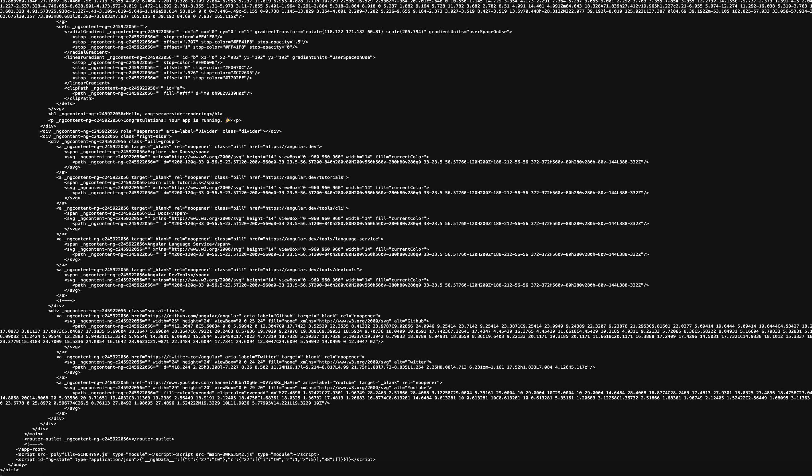
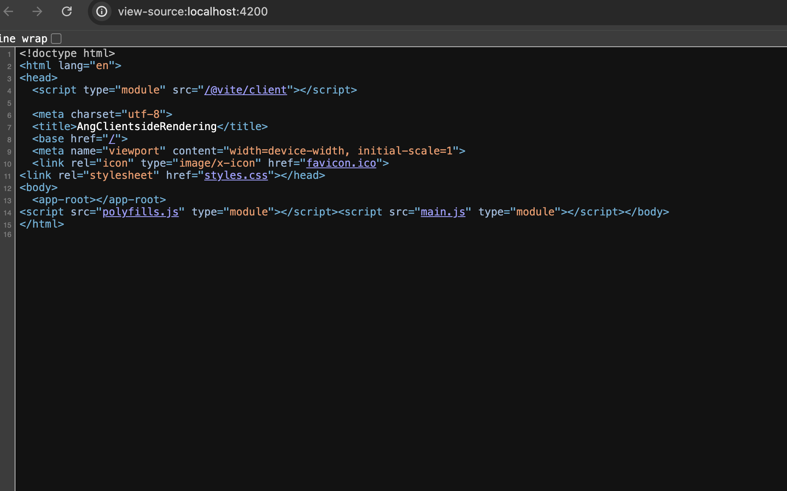

# Server-side rendering

Server-side rendering (SSR) is a process that involves rendering pages on the server, resulting in initial HTML content which contains initial page state. Once the HTML content is delivered to a browser, Angular initializes the application and utilizes the data contained within the HTML.

## Why use SSR?

The main advantages of SSR as compared to client-side rendering (CSR) are:

Improved performance: SSR can improve the performance of web applications by delivering fully rendered HTML to the client, which can be parsed and displayed even before the application JavaScript is downloaded. This can be especially beneficial for users on low-bandwidth connections or mobile devices.

Improved Core Web Vitals: SSR results in performance improvements that can be measured using Core Web Vitals (CWV) statistics, such as reduced First Contentful Paint (FCP) and Largest Contentful Paint (LCP), as well as Cumulative Layout Shift (CLS).

Better SEO: SSR can improve the search engine optimization (SEO) of web applications by making it easier for search engines to crawl and index the content of the application.


## Angular with Server side rendering

### Step 1: Angular with SSR configuration

Create a angular project with SSR capabilities by providing yes in Angular CLI prompt

### Step 2: Verify necessary files

Verify below files are added to project

1) ang-serverside-rendering > server.ts 
2) ang-serverside-rendering > src > main.server.ts
3) ang-serverside-rendering > src > app > app.config.server.ts

And verify this script is added in package.json file, under scripts

```bash
"serve:ssr:ang-serverside-rendering": "node dist/ang-serverside-rendering/server/server.mjs"
```

### Step 3: Verify build

Create build by running below command,

```bash
ng build --configuration=production
```

Run the app using ssr options, by running the script in package.json file

```bash
"serve:ssr:ang-serverside-rendering": "node dist/ang-serverside-rendering/server/server.mjs"
```

### Step 4: Hosting files in nodejs server

After running the script , you will see the below console log in terminal

```bash
 *  Executing task: npm run serve:ssr:ang-serverside-rendering 


> ang-serverside-rendering@0.0.0 serve:ssr:ang-serverside-rendering
> node dist/ang-serverside-rendering/server/server.mjs

Node Express server listening on http://localhost:4000
```

Open the url http://localhost:4000 in browser and all the contents are rendered in view.

### Step 5: Verify whether the content is hosted from server than loading locally.

Right click on the webpage and select view page source, you should see whole DOM file listed.
Ensuring all the contents are rendered from server.



If you verify the same for client side rendering application, only few DOM elements will be present.

